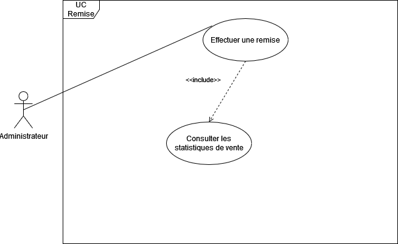

# Correction exercice 1

## Commentaires sur vos travaux

PS : **UC = cas d'utilisation**

1. Attention les associations << include >> et << extend >> ne sont pas systématiques dans un diagramme de cas d'utilisation (il n’y en a pas toujours). Mettez-les uniquement si ça apporte de la valeur dans votre diagramme.
A consommer avec modération.

2. Attention à ne pas confondre détails par exemple "renseigner les informations" ou les conditions "date de naissance", "produits moins vendus" comme un cas d'utilisation.

3. Attention à bien séparer les cas d'utilisation et à les regrouper en thème lorsque c'est possible.

4. Posez-vous bien la question de **QUI (acteur)** et **QUOI (objectif  = cas d'utilisation)**.

5. Attention les commentaires pour apporter des précisions sur vos UC doivent être en dehors de la frontière de votre système. La frontière est délimitée par le frame (grand carré ou rectangle qui contient uniquement les UC et le nom du système ou du package des US).

6. Les principaux acteurs doivent être situés à gauche du diagramme et si vous avez des acteurs secondaires comme d'autres systèmes par exemple la banque, colissimo etc. Ils doivent être situés à droite, vous pouvez préciser le stéréotype << syst >> avant le nom pour qu'on puisse identifier leur nature.

7. Attention, UC connexion --->(include) créer compte signifie qu'à chaque que l'utilisateur doit se connecter il devra satisfaire obligatoirement le cas d'utilisation créer un compte. Autrement dit à chaque fois que je veux me connecter, je dois créer un compte. La meilleure solution est de ne pas mettre de relation include entre les 2 cas.
Dans la description de la connexion, dans les pré-conditions on pourra mettre que pour pouvoir se connecter, l'utilisateur doit avoir un compte dans le système donc qu'il s'est inscrit avant.

8. Attention, respectez bien les standards UML :
- Il n'y a pas de flèche entre une association entre acteur et un cas d'utilisation.
- include et extend, pointillé avec une flèche (pas un triangle blanc qui représente l'héritage).

9. UC parrainer suffit à lui tout seul pour représenter l'objectif du parrainage, vous n'avez pas besoin de rajouter un UC "envoyer le lien de parrainage" qui lui est un détail voir une fin cad solution. Pour rappel, dans un diagramme de cas d'utilisation, on modélise le système du point de vue de l'utilisateur par rapport à ses besoins et objectifs que le système doit satisfaire. Il est encore trop tôt pour parler de la solution.

## Rappels de besoins

Cadeau d'anniversaire pour un client qui effectue un achat le jour de son anniversaire.
Parrainage avec des récompenses pour le filleul et le parrain.
Offres promotionnelles des produits les moins vendues.

### Solutions de modélisation possibles

1. Normalement, il faut tout faire tous vos diagrammes en **Anglais**.

2. Le cas d'utilisation "recevoir un cadeau" est particulier. En effet s'il s'agit d'un produit offert ajouté immédiatement dans la commande ou d'une remise effectuée dans la commande alors ce n'est pas un cas d'utilisation à proprement dit mais un scenario alternatif ou une spécialisation de la commande. Par contre, s'il s'agit d'un objectif en dehors de la commande en cours comme générer un bon d'achat alors il peut être représenter comme un UC qui étend la commande.
Idéalement, il faudra affiner le besoin avec le commanditaire du projet (client) concernant l'expression de ce besoin.

Le cas d'utilisation "commander" peut être découpé en plusieurs sous cas d'utilisation qu'on pourra spécifier dans un autre diagramme de cas d'utilisation pour ne pas surcharger le diagramme actuel.

