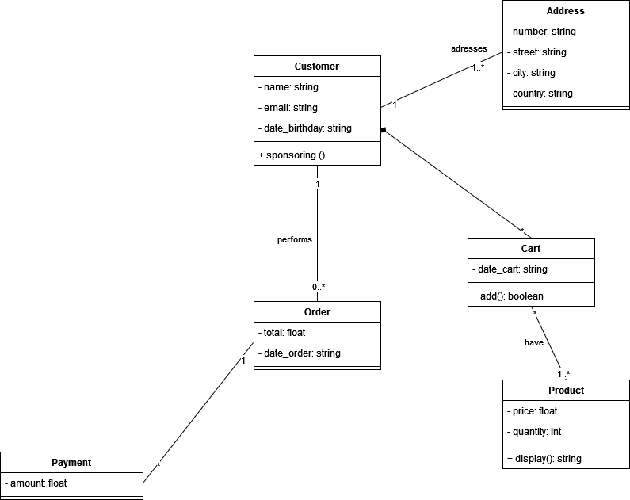

# Correction exercice 3 : diagramme de classes

## Retours sur vos travaux

1. Utilisez l'héritage pour généraliser les propriétés et les méthodes redondantes pour les classes similaires par exemple *Filleul* et *Parrain*. Selon votre approche, il est peut-être dans ce cas précis inutile de faire un héritage entre parrain et filleul car il n'y a pas de spécialisation à proprement dit dans ce 2 classes.

2. Idéalement tout faire en anglais, j'ai toléré le français pour les diagrammes de cas d'utilisation pour éviter la barrière de la langue et concentrer ses efforts dans la compréhension des nouveaux concepts.

Par contre pour le diagramme de classes, il est indispensable que ça soit en anglais.

3. Attention à la notation UML, respectez bien les types de flèche car le sens change.
(Pour rappel  vous pouvez consulter le cheat sheet de la syntaxe UML](https://www.guru99.com/uml-cheatsheet-reference-guide.html)

4. Je n'ai pas insisté mais généralement par défaut les attributs sont en private *-* ou protected *#* (pour l'héritage) et les méthodes en public *+*.

5. Notation du nom de la classe en PascalCase, [voir les conventions de nommage qui existent et leurs utilisations](https://wprock.fr/blog/conventions-nommage-programmation/)

6. Essayez de garder un niveau de détails fidèles aux informations que vous avez en votre possession, en gros ne pas rajouter des attributs qui n'ont pas été spécifiés dans le sujet et à l'oral. Cependant si vous jugez des attributs qui n'ont pas été mentionné mais qui sont très pertinents pour la modélisation, oui vous pouvez les ajouter.

7. **PAS BESOIN DE FAIRE APPARAÎTRE LES GETTERS ET SETTERS DE VOS ATTRIBUTS DANS VOS DIAGRAMMES DE CLASSES**

8. Ce n'est pas complètement faux de faire apparaître *id* dans vos entités cependant éviter lorsque cela n'a pas été spécifié (un réflexe de dev qu'il faut essayer de contenir). *id* est pertinent lorsque vous êtes en train de modéliser une base de données.

9. Pensez à vérifier vos diagrammes de classes à l'aide du diagramme d'objets pour vérifier leurs cohérences.

10. Les noms d'une classe, d'un attribut et d'une méthode doivent être unique dans vos diagrammes.

11. Le prix TTC n'est pas un attribut, il est calculé à partir du prix HT et de la taxe.

## Diagrammes de classes

### Ajout au panier

## Commande

## Parrainage

## Promo sur les produits les moins vendues

## Consulter produit

## Global en rassemblant toutes les entités, attributs et méthodes

La recherche des produits achetés, la carte utilisée durant la commande ainsi que l'adresse de livraison ne seront pas optimales avec ce modèle. En effet il faut passer par d'autres classes intermédiaires pour accéder à ces informations.