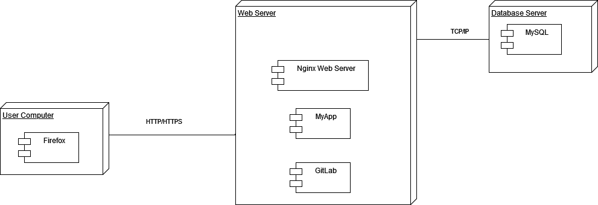

# Correction exercice 4 diagramme de déploiement

- Nginx est un serveur web qui va interpréter nos fichiers PHP si on a opté par exemple pour ce langage de programmation.
- Le client (utilisateur) va accéder à notre application à l'aide d'un navigateur comme Firefox ou autre (qui est un client, cad demandeur d'un service dans l'architecture client-serveur).
- GitLab est un logiciel de gestion de version qui nous permet de versionner et conserver l'historique de notre code hébergé sur notre serveur dédiée (serveur pour un site).
- MyApp est notre application
- MySQL est la base de données qui stocke nos données, ça peut être MariaDB, Oracle, voir une base de données non relationnels tels que MongoDB par exemple.
- HTTP/HTTPS sont des protocoles pour échanger les informations sous forme de lien hypertexte (tout simplement la base du web)
- TCP/IP est le protocole pour faire communiquer des serveurs. La majorité des échanges utilisent ce protocole.